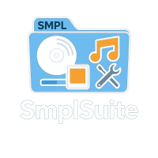

**SmplSuite**  
**Organize Everything. Smarter.**  
*AUDIO • PHOTO • UTILITIES*

---

SmplSuite is a modular suite of creative and utility-focused tools built for modern audio, visual, and file management workflows. Powered by CodeKwa and designed with simplicity and smart automation in mind, each tool within the suite helps creators and organizers take control of their digital content.

### 🔊 Current Audio Tools:
- **SmplMFO** – Music File Organizer that auto-sorts, renames, and enriches music libraries.
- **SmplSync** *(coming soon)* – Sync and transfer music across devices like Android, iPhones, SD cards, and more.
- **SmplPlayer** *(planned)* – A modern local music player with playlist support and radio streaming.

### 🎨 Upcoming Photo Tools:
- Custom visual file organizer
- Print mockup generator
- Asset tagger for creatives

### 🧰 Upcoming Utilities:
- Smart file cleanup tools
- Metadata fixer for all media types
- Folder deduplication and sync logic

---

## 🔗 Related Projects
| Tool         | Free Version                             | Pro Version                         | Status     |
|--------------|-------------------------------------------|--------------------------------------|------------|
| **SmplMFO**   | [View on GitHub](https://github.com/CodeKwa/SmplMFO) | [Download on smplsuite.com](https://smplsuite.com/) | ✅ Released |
| **SmplSync**   | Coming soon                               | Coming soon                          | 🔧 In Dev  |
| **SmplPlayer**   | Coming soon                               | Coming soon                          | 🧪 Planned |

---

## 🔧 Built By:
**CodeKwa – Kwami J.M.**  
Pushing creative utilities for digital freedom.

---

## 📬 Feedback or Suggestions?
Please use the Issues tab or visit [smplsuite.com/contact](https://smplsuite.com/contact)

Stay tuned for more tool releases under the SmplSuite banner.
